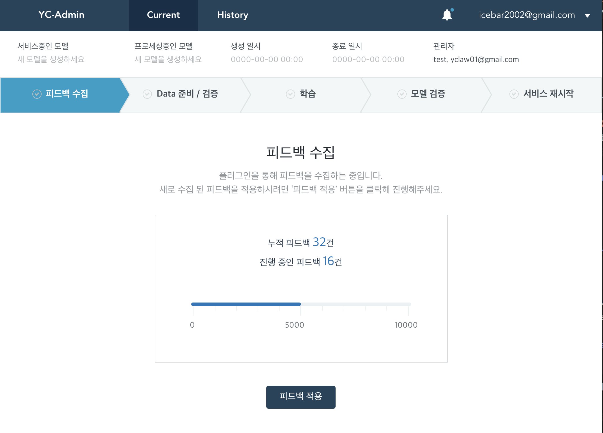
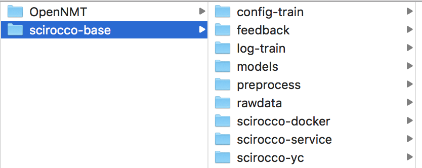

# Scirocco-service

## Discription
### 도메인 번역 서비스를 위한 배치 학습 매니저
* 사용자의 번역 피드백을 정리하여 일정량 이상의 피드백을 모아 현재 모델의 성능을 향상시킨다.

    

### 환경
* OpenNMT
* Docker
* 초기 경로를 반드시 아래와 같이 설정해야 함
    * \[projectdir\]/scirocco-base/scirocco-service
* 기본 프로젝트 구조는 아래와 같다.
    * scirocco-base/scirocco-service
    * scirocco-base/scirocco-yc
    * scirocco-base/scirocco-docker
    

## client
### 환경
* Node: v10.10.0
* Vue-cli3 project generation

### 빌드 및 실행
이 명령이 선행되어야 합니다.
```
$ cd client
$ npm install
```
#### 빌드
* 빌드 타겟은 package.json 내에 ./server/public 으로 명시되어 있음
```
$ npm run build
```
#### 테스트
* 유닛테스트
    * Jest 사용. 설정은 ./client/jest.config.js
    * ./client/tests/unit
```
$ npm run test:unit
```
* E2E테스트
(현재 테스트케이스가 작성되어있지 않음)
#### 실행
```
$ npm run serve
```
### 설정
- ./server 사용 시 proxy: 'http://localhost:3000' 세팅

## server
### 환경
* Node v10 이상
* Express 4.16.3
### 구조
* helpers
    * db.js : lowdb DAO.
    * file.js : file IO tool for directory.
    * error-handler.js, jwt.js : TBD
* shells : docker 실행, 파일 읽기 등 실행 연습용 파일들 모음.
### 설치
```
$ cd server
$ npm install
```
#### 실행
```
// for development
$ npm run dev

// for prod
$ npm start
```
#### 테스트
* API 테스트만 작성...중 ㅠㅠ
```
$ npm run test
```
### 설정
* config.json : JWT secret key
* .env : BASE_PATH 이외 트레이닝에 필요한 scirocco_base 경로들 명시

### 기타
* OpenNMT-commands.md : opennmt 실행 shell 참고용

## database
* db.json
    * Spec : TBD
